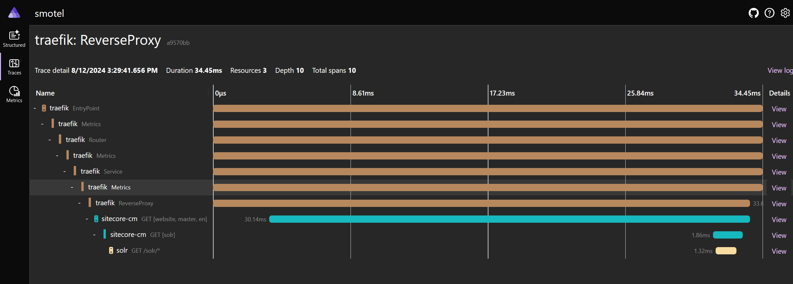

# Sitecore MVC OTel (OpenTelemetry)

Shows how to implement [OpenTelemetry](https://opentelemetry.io/) support for Sitecore MVC solutions.

## Features

1. The following is sent to the OTel backend:
   1. ASP.NET traces and metrics, including CPU/Memory, SQL, Solr, HttpClient and WebRequest calls
   1. Sitecore context specific data (item, template, site, language etc.) for traces
   1. Sitecore logging is forwarded to Microsoft.Extensions.Logging which is sent automatically
   1. Traefik traces and metrics
   1. Solr traces and metrics
1. Uses the [ASP.NET Aspire Dashboard](https://learn.microsoft.com/en-us/dotnet/aspire/fundamentals/dashboard/explore) as a OTel compatible backend which stores traces, metrics and logs in memory only (great for local development environments). Or send data to for example [the OpenTelemetry Collector](https://opentelemetry.io/docs/collector/), Jaeger, Azure Monitor, Datadog, SigNoz, New Relic and many many more...

### Notes

- For now it's not possible to add [OpenTelemetry .NET Automatic Instrumentation](https://opentelemetry.io/docs/zero-code/net/) to the ID service as it can only run on .NET 6.0 (as of 10.4.0).

## Contributing

### Prerequisites

- Visual Studio 2022
- Docker Desktop or Docker engine
- Sitecore license file

### Starting

1. `.\init.ps1 -License C:\license\license.xml -AdminPassword b`
1. `dotnet tool restore`
1. `msbuild /v:m /p:Configuration=Debug /t:"Restore;Build" /p:DeployOnBuild=true /p:PublishProfile=DockerPublish` or publish `Platform` project from Visual Studio.
1. `docker compose up -d --build`
1. `dotnet sitecore login --authority https://id.smotel.localhost --cm https://cm-platform.smotel.localhost --allow-write true`
1. `dotnet sitecore index schema-populate`

### Service urls

- <https://aspire.smotel.localhost>
- <https://cm-platform.smotel.localhost>
- <https://solr.smotel.localhost>
